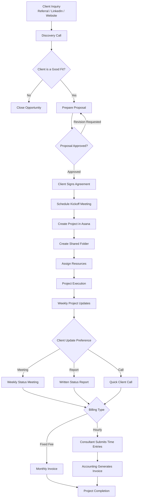

# Workflow Diagram

## Consulting Engagement Workflow

---

## Notes

### Known Exceptions

- Referral leads are not always entered into HubSpot.
- Consultants may begin work before project setup is completed.
- Proposal revisions may occur before approval.
- Resource allocation may be performed by the Managing Partner for high-priority clients.
- Consultants sometimes update project progress through Slack or Email instead of Asana.
- Late time entries delay invoice generation.

### Assumptions

- Every engagement follows the same high-level workflow.
- Every project has a designated Project Manager.
- All clients sign an agreement before project execution unless an exception exists.